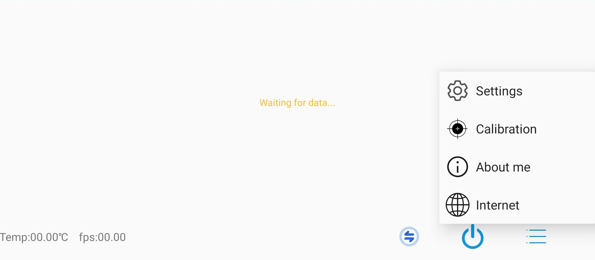
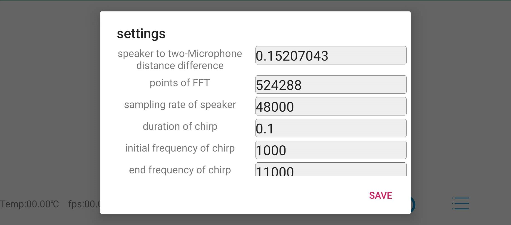
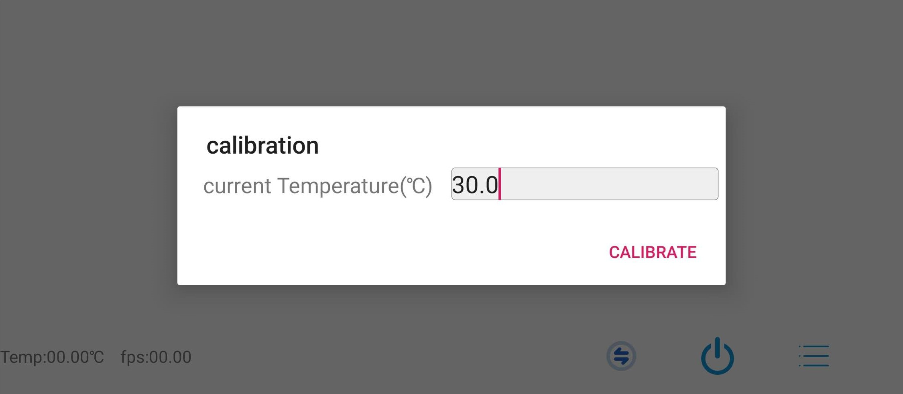
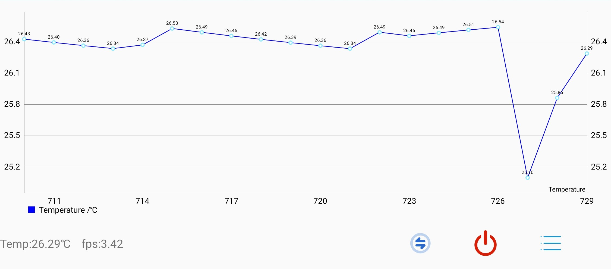
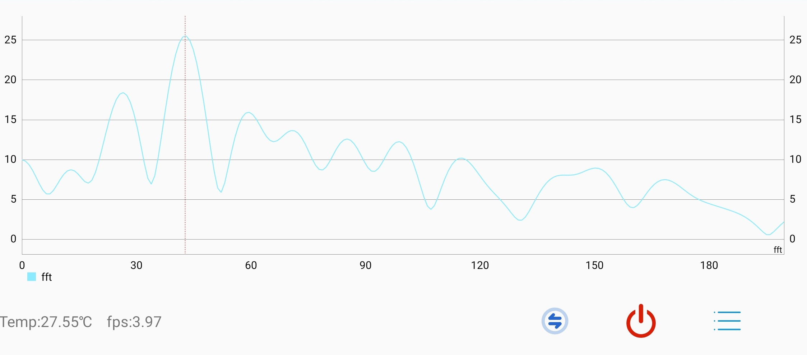
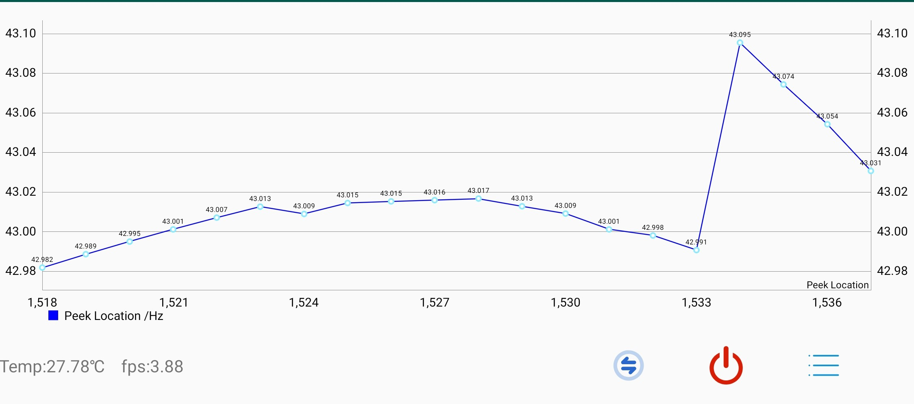

# AcuTe
Temperature is significant for many applications such as weather forecasting, precision agriculture, and building management. Though measuring ambient temperature is often deemed as an easy job, collecting large-scale temperature readings in real-time is still a formidable task. Recent blooming of network ready (mobile) devices and the subsequent mobile crowdsourcing applications do offer an opportunity to accomplish this task, yet equipping commodity devices with ambient temperature sensing capability is highly non-trivial and hence has never been achieved. In this paper, we propose Acoustic Thermometer (AcuTe) as the first ambient temperature sensor empowered by a single commodity smartphone. AcuTe utilizes on-board dual microphones to estimate air-borne sound propagation speed, thereby deriving ambient temperature. To accurately estimate sound propagation speed, we leverage the phase of chirp signals, circumventing the low sample rate on commodity hardware. In addition, to prevent disruptive audible transmissions, we convert chirp signals into white noises and propose a pipeline of signal processing algorithms to denoise received samples. Furthermore, we propose to use both structure-borne and air-borne propagations to address the multipath problem. As a mobile, economical, highly accurate sensor, AcuTe may potentially enable many relevant applications, in particular large-scale indoor/outdoor temperature monitoring in real-time. We conduct extensive experiments on AcuTe; the results demonstrate a robust performance, a median accuracy of 0.3 degree even at a varying humidity level, and the ability to conduct distributed temperature sensing in real-time.

The files under android are for Android-side application, written purely in Java. The files under server are for server-side display, using node.js. 
Below is a short video demo for this project. 


<div align=center></div>

For android app, the minimum required os version is Android KitKat 4.4.0. The following pictures shown some snapshots of this application. 

The following is the menu for setting: 

<div align=center></div>

The first thing to do is to configure the parameters for sensing. The speaker to microphone distance difference should be calibrated at known temperature. This app provoides only one-point application. More points are preferable and can improve accuracy. The higher the sampling rate, the better the stability of the sensing system. 

<div align=center></div>

The calibration page only needs to input current temperature.

<div align=center></div>

Real-Time temperature data over time.

<div align=center></div>

Real-time frequency spectrum for debug. 

<div align=center></div>

Extracted peak value for debug. 

<div align=center></div>


If you find this useful, please cite our paper

```
@inproceedings{AcuTe,
author = {Chao, Cai and Zhe, Chen and Hengling, Pu and Liyuan, Ye and Menglan, Hu and Jun, Luo},
title = "{AcuTe: Acoustic Thermometer Empowered by a Single Smartphone}",
year = {2020},
booktitle = {Proc. of ACM SenSys}, 
pages = {1-14}
}
```


copyright:

```
You may use, copy, reproduce, and distribute this Software for any non-commercial
purpose, subject to the restrictions in this NTUITIVE-LA. Some purposes which can be
non-commercial are teaching, academic research, public demonstrations and personal
experimentation. You may also distribute this Software with books or other teaching
materials, or publish the Software on websites, that are intended to teach the use of the
Software for academic or other non-commercial purposes.
You may not use or distribute this Software or any derivative works in any form for
commercial purposes. Examples of commercial purposes would be running business
operations, licensing, leasing, or selling the Software, distributing the Software for use
with commercial products, using the Software in the creation or use of commercial
products or any other activity which purpose is to procure a commercial gain to you or
others.
If the Software includes source code or data, you may create derivative works of such
portions of the Software and distribute the modified Software for non-commercial
purposes, as provided herein.
If you distribute the Software or any derivative works of the Software, you will distribute
them under the same terms and conditions as in this license, and you will not grant other
rights to the Software or derivative works that are different from those provided by this
NTUITIVE-LA.
If you have created derivative works of the Software, and distribute such derivative
works, you will cause the modified files to carry prominent notices so that recipients
know that they are not receiving the original Software. Such notices must state: (i) that
you have changed the Software; and (ii) the date of any changes.
```
